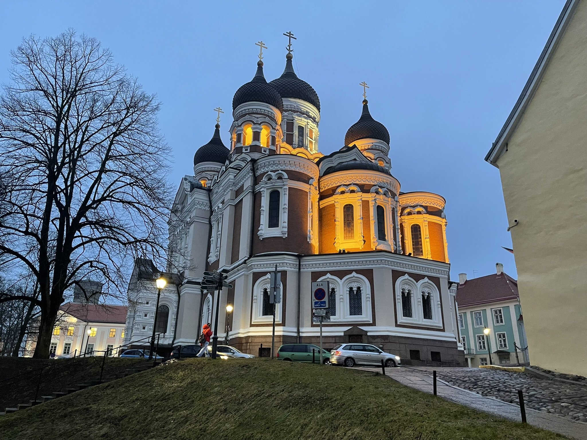
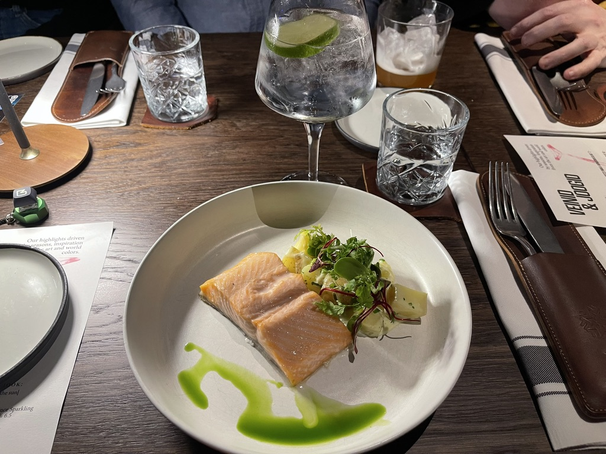
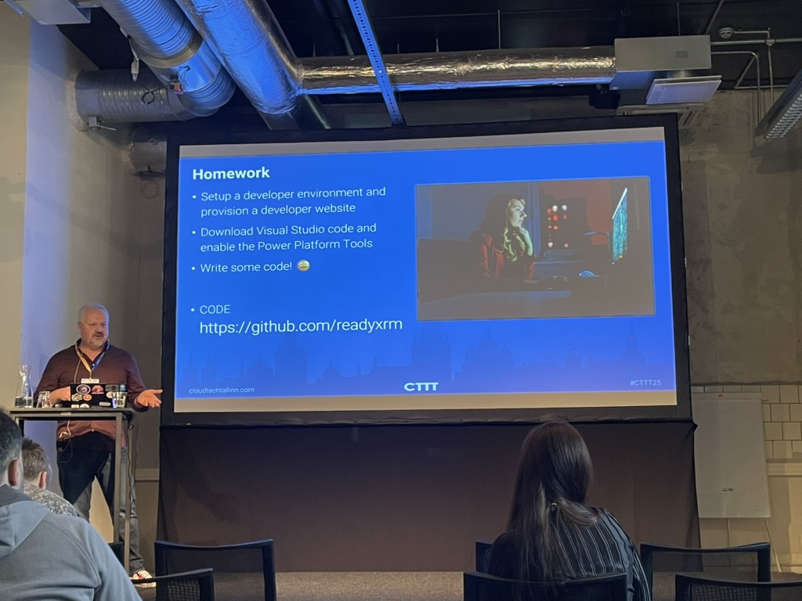

In january of this year, I travelled to Tallinn to speak at the [Cloud Technology Townhall Tallinn 2025](https://cloudtechtallinn.com/), or CTTT2025 in short. This is a tech conference in the capital of Estonia, dubbed the Sillicon Valley of Europe. Startups like Wise and Skype originate from there, as well as being the HQ for the EU IT services and the NATO Cyber Defence Center of Excellence. The conference is mostly focused on Power Platform, M365 and Sharepoint, so my session about Azure Policy fit into the governance theme.

## Trip
I boarded a plane on wednesday morning, landing in Tallinn during lunch time. The organization arranged a pickup from the airport beforehand, which was a really nice touch. At Schiphol Airport I met up with some other speakers, already joining in on the pre-conference fun. The organization also set up a Whatsapp group so we could chat with the other speakers who were also on their way. Some even travelled days earlier so they could explore the city!

I arrived at the hotel at around 14:00. The speaker dinner was at 18:00, so that allowed for some sightseeing around the old town of Tallinn. Some other speakers wanted to do this as well, so we met up and walked around town for some coffee and nerd-talk.

## Speaker dinner
The speaker dinner was at [Fotografiska Tallinn](https://tallinn.fotografiska.com/en/restaurants/fotografiska-restaurant), which is a really nice restaurant on the 6th floor focusing on sustainability and organic dishes. They even had a cocktail bar with two bartenders serving up the best drinks 🍸🍹. During dinner, I got to know some fellow speakers while enjoying the nighttime skyline of old-town Tallinn.

After dinner, we walked back to the hotel to catch some sleep, as my presentation would be in the morning.

## My session
The event took place in [Kultuurikatel Tallinn](https://kultuurikatel.ee/en), which is an old factory turned into a very nice event venue. I delivered my session on Azure Policy, which showed the attendees what is possible and how to set things up. With some practical examples, I aimed to make starting out with good governance easy. Sometimes all you need is a good example and a little push in the right direction, which gives you immediate superpowers because implementing good policies can make an Azure environment so much more secure and enjoyable to work in.

Afterwards, there was lunch (and very tasty at that!) and I was able to join some other sessions as well!

## Friday and the trip back
I got to spend the friday at the event as well, engaging with fellow speakers and attending yet more sessions. In the afternoon, my flight back to Amsterdam was scheduled, so I booked a taxi to the airport with some other speakers who needed to get on the same flight.

Back home, I had some dinner and went to bed after a very nice (albeit very tiring) trip! 

## Would I speak here again?
_ABSOLUTELY!_ I would recommend speaking here to anyone. Why?
- The venue is top notch. Speaker rooms were clean, spacious and plentiful.
- The audience was nice! People really came for your session content and asked questions if they had any.
- The hotel and the organization was epic. Overall great communication, a pickup from the airport, help was available if you had questions, and a nice personal note when I arrived in my room.

Especially if you are a new speaker, this is a great event to speak at. The other speakers had a great vibe that made you feel welcome right from the start. Personally, this was my first speaking trip outside of the Netherlands and this made all the difference.

See you next year!