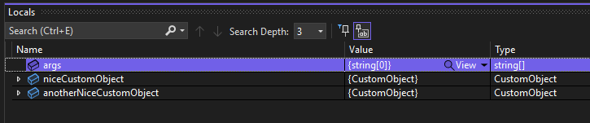
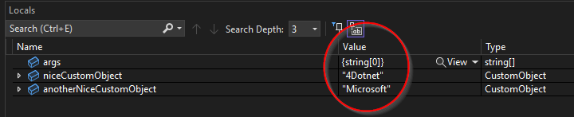

When working on a .NET project, you are highly likely to use custom objects. When you start debugging your code, you can see them in the debugger. However, the default way these objects are displayed by the debugger is not very handy nor developer friendly. You are probably interested in the identifying properties of your custom object rather than the name of your class.

# Example program
> Note: The example program is using top-level statements, so you will not see any namespaces or method body. To learn more, check out: https://docs.microsoft.com/en-us/dotnet/csharp/whats-new/tutorials/top-level-statements

Consider the following program:

var niceCustomObject = new CustomObject("4Dotnet", "Super cool description.");
var anotherNiceCustomObject = new CustomObject("Microsoft", "Another description.");

Console.WriteLine("Hello, World!");

public class CustomObject
{
    public string Name { get; set; }
    public string Description { get; set; }

    public CustomObject(string name, string description)
    {
        Name = name;
        Description = description;
    }
}


When you set a breakpoint on line 4, the custom object will be displayed in the debugger like this:

That isn't helping! It would be much nicer to see the name of the custom object right away, so we can easily distinguish between different objects of the same kind.

# Implementing the DebuggerDisplayAttribute
Lucky for us, we can use the `DebuggerDisplayAttribute` available in .NET. We can put it above our class and provide a string argument containing the template we want to use for displaying object instances in the debugger. The string is evaluated as the name of a field, property, or method.

In our case, we use the `Name` field so we can easily identify each object instance.


using System.Diagnostics;

var niceCustomObject = new CustomObject("4Dotnet", "Super cool description.");
var anotherNiceCustomObject = new CustomObject("Microsoft", "Another description with a different text.");

Console.WriteLine("Hello, World!");

[DebuggerDisplay("{Name}")]
public class CustomObject
{
    public string Name { get; set; }
    public string Description { get; set; }

    public CustomObject(string name, string description)
    {
        Name = name;
        Description = description;
    }
}


And no surprise here, we can now see the value appear in the debugger:

# Conclusion
Using this simple attribute, we can debug complex classes much easier by simply telling the debugger how we want it to display objects. To learn more about the specifics of the `DebuggerDisplayAttribute`, check out: https://docs.microsoft.com/en-us/visualstudio/debugger/using-the-debuggerdisplay-attribute?view=vs-2022