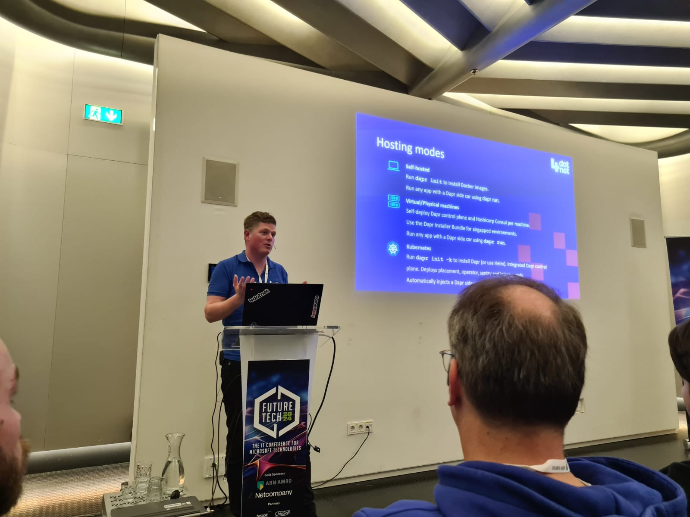

## Introduction
Yesterday I had the privillege of speaking at a tech conference for the first time! My colleague [Eduard Keilholz](https://hexmaster.nl/) pushed me to answer the call for papers and get started with speaking about cool tech at conferences. To my big surprise, my session was accepted and could take this next step in my career!

## My session
During the work for [4Dotnet](https://4dotnet.nl), I work for one of our customers where we are actively implementing microservices using .NET, Dapr and Azure Container Apps. In the local development environments, we use .NET Aspire to quickly gain insights into what the services are doing. OpenTelemetry is the key to discovering potential issues with the services before they occur in production.

With this experience, the idea for the session was born. How can I teach developers to build a good local development environment for distributed applications?

## Slides
Interested in the slides? I got you covered! [Click here to download the slides.](presentation_public.pdf)

## Code
Of course the code that I used to build the demo is also available. [Click here to be taken to the Github repository](https://github.com/fvandillen/futuretech-dapr-aspire). Do you have any questions? No problem, I'm happy to help you out and get started using Dapr and Aspire. [Just open a Github issue here](https://github.com/fvandillen/futuretech-dapr-aspire/issues) and we'll be in touch!